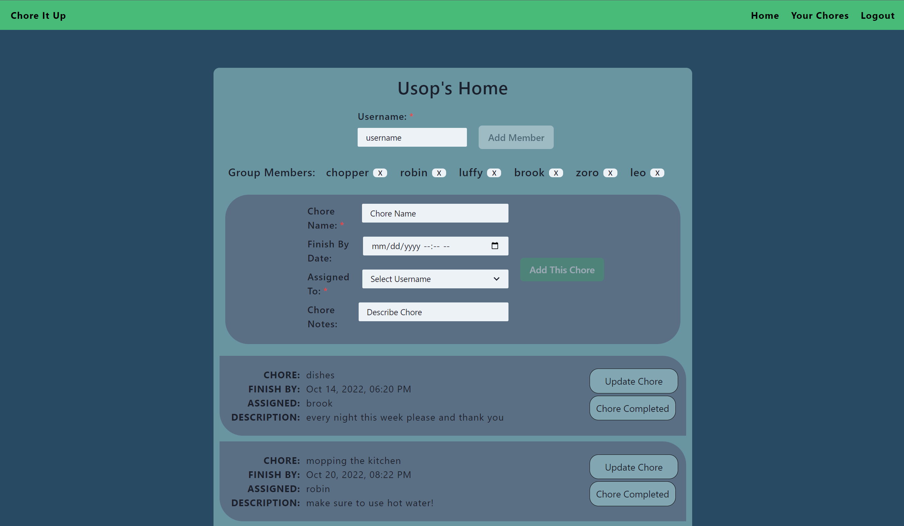

# chore-it-up

## Description

Chore It Up is a full stack application created in order assist those living under one roof with oragnizing necessary chores and house maintence.

## Table of Contents

-   [Description](#Description)
-   [Installation](#Installation)
-   [Usage](#Usage)
-   [Screenshots](#Screenshots)
-   [Contributing](#Contributing)
-   [Questions](#Questions)

## Installation

Install node.

Run `npm install`

Run server with `npm start`

## Usage

Chore it up was created with non-traditional living situations in mind. Users are able to create an account and a house group or be added to an already existing group. All users are able to create chores and assign the chores to other house members. If needed, a member can be removed from said group and a chore can be deleted upon completion. All chores are viewable to other housemembers and house members alone.

## Screenshots

## Contributing

[Brandon Geertsen](https://www.linkedin.com/in/brandon-geertsen/)
[Matthew Potwora](https://www.linkedin.com/in/matthew-potwora-989b86232/)
[Lorreina Guyett](https://www.linkedin.com/in/lorreina-guyett-261babb2/)
[Robin Ostrowski](https://www.linkedin.com/in/robinostrowski/)
[Sean Maddow](https://www.linkedin.com/in/sean-maddox-b34487109/)

## Questions

If you have additional questions, please reach out using the contact information below.

**Contacts**

-   Brandon Geertsen - [Github](https://github.com/bgeertsen) - [Email](mailto:brandon.geertsen@gmail.com)
-   Matthew Potwora - [Github](https://github.com/potworam) - [Email](mailto:Matthewpotwora@yahoo.com)
-   Lorreina Guyett - [Github](https://github.com/slorreina369) - [Email](mailto:slorreina369@gmail.com)
-   Robin Ostrowski - [Github](https://github.com/Bin-Ostrowski) - [Email](mailto:Bin.ostrowski@gmail.com)
-   Sean Maddox - [Github](https://github.com/stmaddox) - [Email](mailto:sean.maddox89@yahoo.com)
